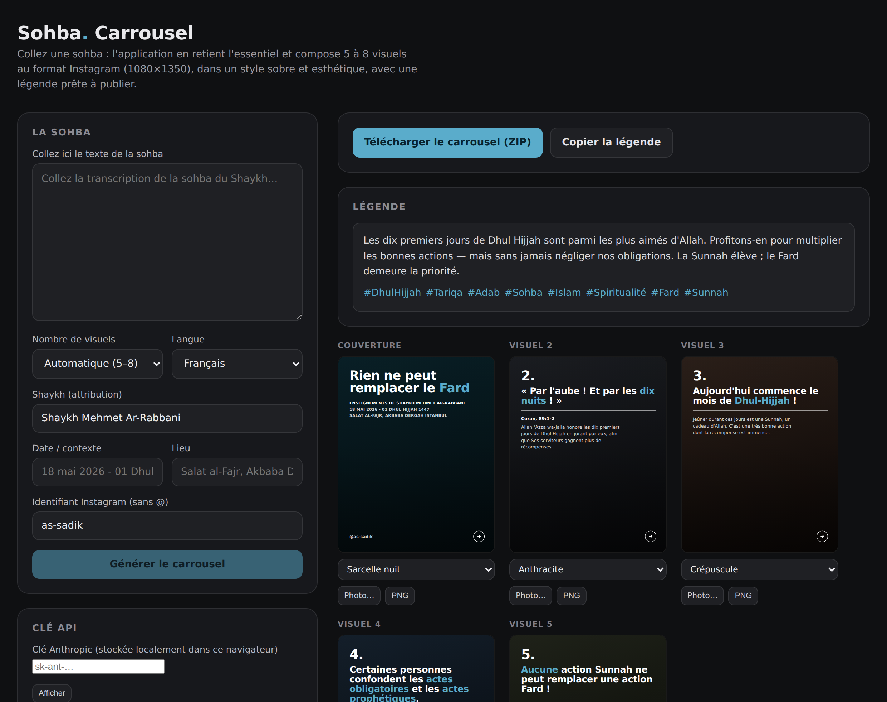

# Sohba · Carrousel

Générateur de carrousels Instagram à partir d'une **sohba** (causerie spirituelle).
Vous collez le texte de la sohba ; l'application en **retient l'essentiel**, dégage
les points saillants, et compose **5 à 8 visuels** au format Instagram
(**1080×1350**) dans un style sobre, esthétique et impactant — plus une **légende**
prête à publier.

L'extraction est réalisée par **Claude (Opus 4.8)** d'Anthropic.



## Deux modes

L'application propose deux façons de générer le contenu :

- **Manuel · gratuit (par défaut)** — vous copiez une instruction prête à l'emploi,
  vous la collez dans **claude.ai** (votre abonnement existant), puis vous recollez
  la réponse de Claude dans l'application qui fabrique les visuels. **Aucune clé API,
  aucun paiement.**
- **Automatique · clé API** — l'application appelle directement l'API Anthropic.
  Plus fluide (un seul clic) mais facturé à l'usage et nécessite une clé API.

---

## Fonctionnalités

- **Espace de saisie** : collez n'importe quelle transcription de sohba.
- **Extraction intelligente** : Claude résume l'enseignement en une couverture +
  4 à 7 points clés, sans déformer ni inventer de citations.
- **Design fidèle** à vos posts : typographie grasse, **mot clé en accent bleu**,
  numéros de slide, filets, flèches de navigation, identifiant en bas.
- **Fonds** : palette de dégradés sobres par défaut, ou **votre propre photo** par
  visuel (téléversement).
- **Export** : chaque visuel en PNG 1080×1350, ou tout le carrousel en **ZIP**
  (visuels + `legende.txt`).
- **Légende** générée avec hashtags, copiable en un clic.
- **Mode démo** : ajoutez `?demo=1` à l'URL pour visualiser un exemple sans clé API.

---

## Installation

Prérequis : **Node.js 18+**.

```bash
npm install
```

### Clé API Anthropic

Obtenez une clé sur [console.anthropic.com](https://console.anthropic.com/).
Deux possibilités :

1. **Côté serveur (recommandé)** — copiez `.env.example` en `.env.local` :

   ```bash
   cp .env.example .env.local
   # puis éditez .env.local et renseignez ANTHROPIC_API_KEY=sk-ant-...
   ```

2. **Côté navigateur** — laissez la variable serveur vide et collez votre clé dans
   le panneau « Clé API » de l'interface. Elle est stockée localement dans votre
   navigateur (`localStorage`) et envoyée uniquement à votre propre serveur.

---

## Lancer l'application

En développement :

```bash
npm run dev
# http://localhost:3000
```

En production :

```bash
npm run build
npm run start
```

---

## Utilisation

1. Collez la sohba dans la zone de texte.
2. Renseignez (facultatif) le Shaykh, la date, le lieu, l'identifiant Instagram,
   le nombre de visuels et la langue.
3. Cliquez sur **Générer le carrousel**.
4. Ajustez les fonds (dégradé ou photo) visuel par visuel.
5. **Télécharger le carrousel (ZIP)** ou exporter un visuel à la fois en PNG.
6. **Copier la légende** pour la coller dans votre publication.

---

## Architecture

```
app/
  layout.tsx              Police (Montserrat) + métadonnées
  globals.css             Système de design — interface + visuels 1080×1350
  page.tsx                Interface : saisie, options, aperçu, export ZIP/PNG
  api/generate/route.ts   Appel Claude (Opus 4.8) en sortie structurée (JSON)
components/
  Slide.tsx               Rendu d'un visuel (couverture / contenu)
  AccentText.tsx          Mise en accent des mots entourés de **
lib/
  types.ts                Modèle de données partagé
  backgrounds.ts          Palette de fonds sobres
  demo.ts                 Exemple pour le mode ?demo=1
```

- Les visuels sont rendus en **HTML/CSS** à leur taille native (1080×1350) puis
  exportés en PNG via **html-to-image** ; le ZIP est assemblé avec **JSZip**.
- La clé API ne quitte jamais votre serveur : la route `/api/generate` est la
  seule à dialoguer avec Anthropic.

---

## Notes

- **Fidélité du contenu** : l'invite système demande explicitement à Claude de
  rester fidèle à la sohba, de ne pas inventer de citations ni de sources, et de
  respecter l'adab (attribution correcte, ton mesuré). Relisez toujours le rendu
  avant publication.
- **Avertissements `npm audit`** : l'application reste sur Next.js 14.x. Les
  avertissements résiduels concernent des fonctionnalités non utilisées ici
  (optimiseur d'images, rewrites) ; leur correctif impose une montée majeure vers
  Next 16. Pour un outil local mono-utilisateur, ce n'est pas nécessaire.
